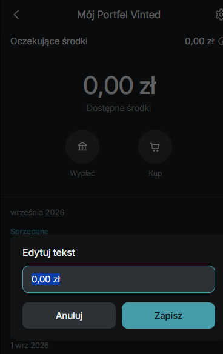

# This interface is built to look like the vinted app on your phone. You can edit a bunch of things like prices and names without much trouble. It feels pretty straightforward once you open it up.

$ The main part is that it is lightweight and works on both ios and android kind of layouts. No frameworks or anything extra. You are able to customize wallet stuff and transactions by clicking on them. I think that $includes the title and balances along with dates and statuses. Navigation can be changed too but I am not totally sure how far it goes.

Editing happens through a modal that comes up and you just type and hit save. The changes show immediately which is convenient. For getting it running you clone from that github link and open index.html in a browser. That is basically it.

The structure has the html file and a readme. Tech is just the basic web stuff with inter font. It mentions no connection to vinted which makes sense since it is custom. Some people might find the dark theme easy on the eyes. That part stands out a bit.

The editing system seems simple but maybe it gets a bit messy with many changes.
## Example SCR

